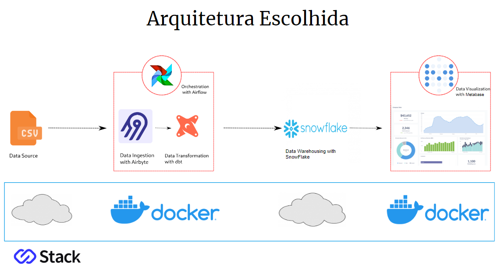

# Modern Data Stack

Repositório para armazenar os artefatos do Pipeline utilizando Modern Data Stack com AirByte + DBT + Airflow + SnowFlake + Metabase

## Arquitetura Escolhida

## Infraestrutura:

- Setup do ambiente de desenvolvimento (Hardware, Software - Linux, Python, Docker, Curl, Pip, Git, Npm, etc...) - Construído com o Gitpod

- Setar as Permissoes do Gitpod ao Repositorio no Github - Ok

- Subir o Airbyte via docker 
    - Fork no projeto do Airbyte -- https://github.com/jorgebarrosmedeiros/airbyte.git
    - Clonar o repositório - git clone -b modern-data-stack https://github.com/jorgebarrosmedeiros/airbyte.git
    - cd airbyte
    - docker-compose-up

- Subir o Airflow via docker
    - curl -LfO 'https://airflow.apache.org/docs/apache-airflow/2.5.0/docker-compose.yaml'
    - mkdir -p ./dags ./logs ./plugins
    - echo -e "AIRFLOW_UID=$(id -u)" > .env
    - docker compose up airflow-init
    - docker compose up

- Subir o Metabase via docker 
    - Criar docker-compose.yaml
    - executar o docker compose up

- Snowflake Data Warehouse:
    
    - Criar a Conta no SnowFlake 
    - Verificar a existência das tabelas 
    - Obter os links de conexão e nome da conta 

- Criar o script de execução 

- Testar a Execução 

## Extração:

- No Airbyte:

    - Conectar com as origens baseadas nos Csvs 
    - Criar as entidades no snowflake através do script base da documentação    
    - Conectar o destino no snowflake 
    - Criar as conexões do airbyte associando as origens ao destino 
    - Testar as conexões 

## Preparação:

- No Airbyte (Destination Loading Method):

    - Local Staging (Ambiente de Desenvolvimento) 
    - Cloud Staging (Ambiente de Produção) 

## Transformação:

- No Dbt:

    - Criação da Conta  
    - Conexão com o Github  
    - Criação do Dbt Project  
    - Criação do Profile de conexão com o snowflake 
    - Criação do Schema 
    - Criação dos Modelos Base 
    - Criação do Modelo Relacionado 
    - Visualização gráfica do modelo 
    - Teste de execução 
    - Commits, Branches, Pull Requests, Merges no Github  
    - Obtenção do link de conexão com o Airbyte  

## Visualização:

- No Metabase:

    - Conectar Metabase com o Snowflake 
    - Criar uma Question  
    - Criar um Dashboard 
    - Adicionar uma Question 
    - Visualizar o Resultado  

## Orquestração:

- No Airflow:

    - Criar a dag  
    - Criar a Docker network
    - Incluir nos composes a network criada
    - Setup Up no serviço
    - Testar a conexao entre os containers do airflow e do airbyte
    - Criar as conexões com o Airbyte através do script  
    - Testar a execução do pipeline  

## Encerramento:

- Material de Apoio:

    - Links 
    - Códigos fonte
    - Apresentação
